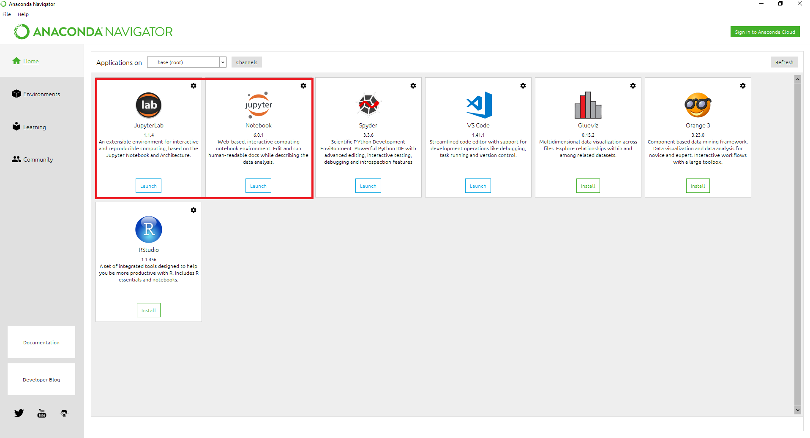
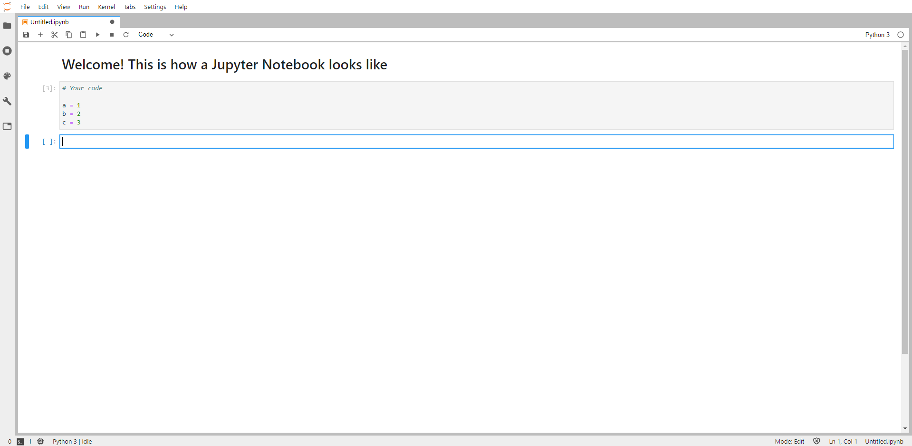
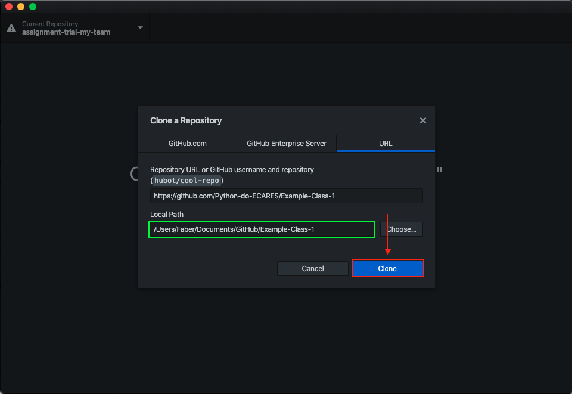
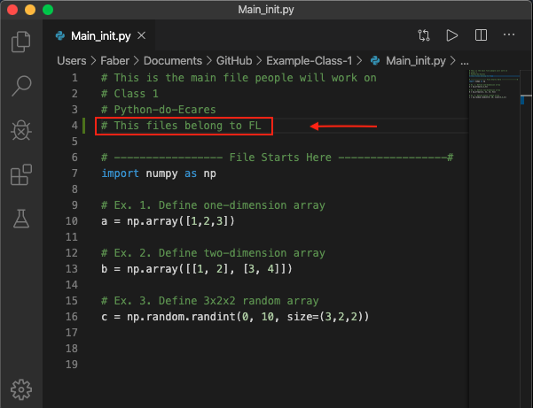
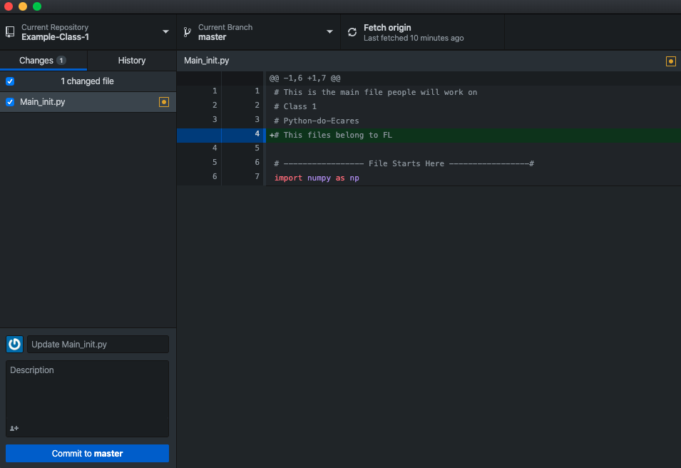
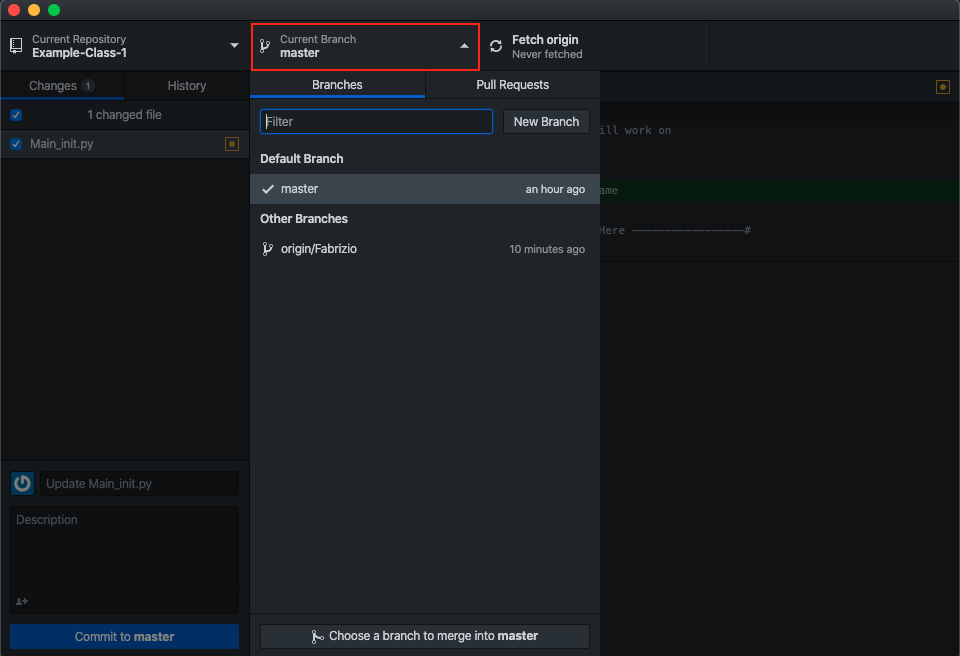

# Instructions
This repo contains instructions about how to use GitHub. Participants to the course are expected to follow a few simple rules in order to faciliate joint works and ensure reproducibility. 

## Dictionary
When learning a new language, one has to start from the basics. GitHub most fundamental words are: **repository**, **branch**, **merge**, **push** and **pull**. Take a look at [Hello World - GitHub](https://guides.github.com/activities/hello-world/) for a brief explanation of each of them.

## Installing GitHub Desktop
In this course, we interact with GitHub through the GitHub Desktop application. Download and install (GitHub Desktop)[https://desktop.github.com] on your computer. The installation process creates a folder named "GitHub". Make sure to know where it is located on your computer and/or change its directory where you prefer (e.g. Desktop).

## Class Organization
Each class has its own repository. You can find it under the [course homepage](https://github.com/Python-do-ECARES). In order to work on the weekly exercises, please follow the following instructions. 

### Step 1. Clone repository
Go to the relevant repo page on GitHub and click on the "Clone or download" button.

Choose "Open in Desktop".

This will open a window in your GitHub Desktop environment. Check the local path where to clone the repo and click "Clone".

### Step 2. Make Changes
Open the file "Main_init.py" in your favourite compiler (e.g. VS Code). Add a comment line with your name.

Save the file. Changes will be displayed in GitHub Desktop as follows.

### Step 3. Create Your Own Branch And Commit Changes
Click on "Master" in the top panel. Then click on "New Branch". **Never directly commit your changes to the Master**.

Give the new branch your name. Then click "Create Branch".

